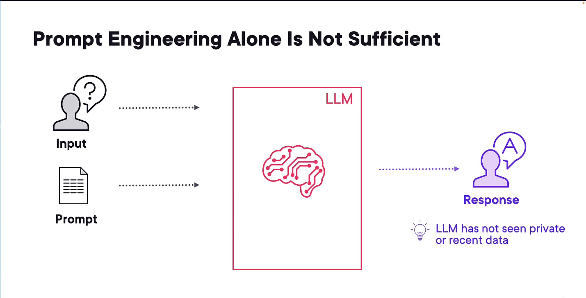
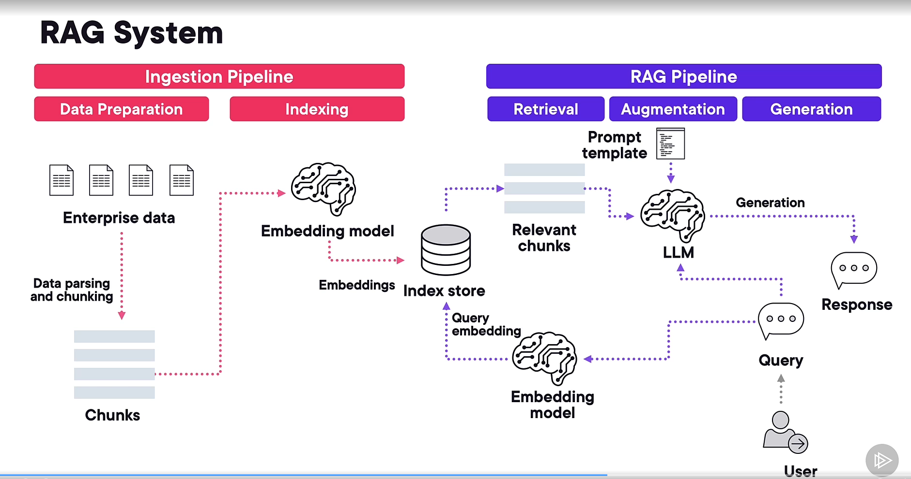
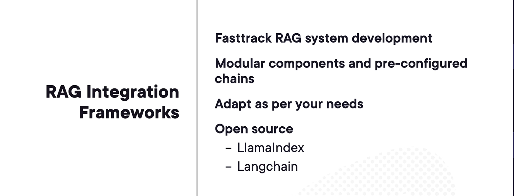
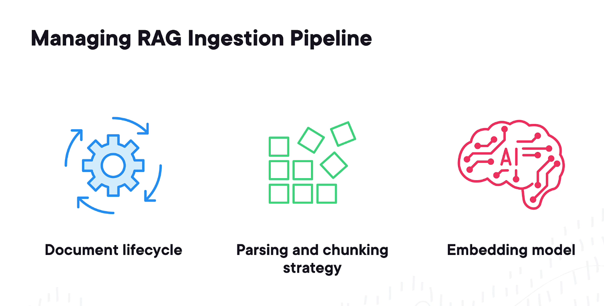
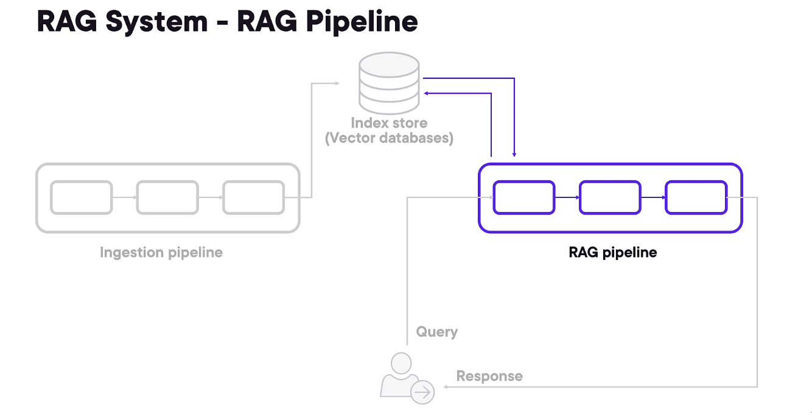
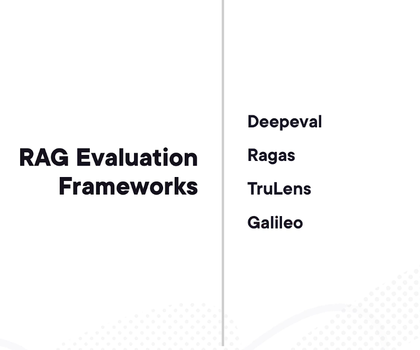
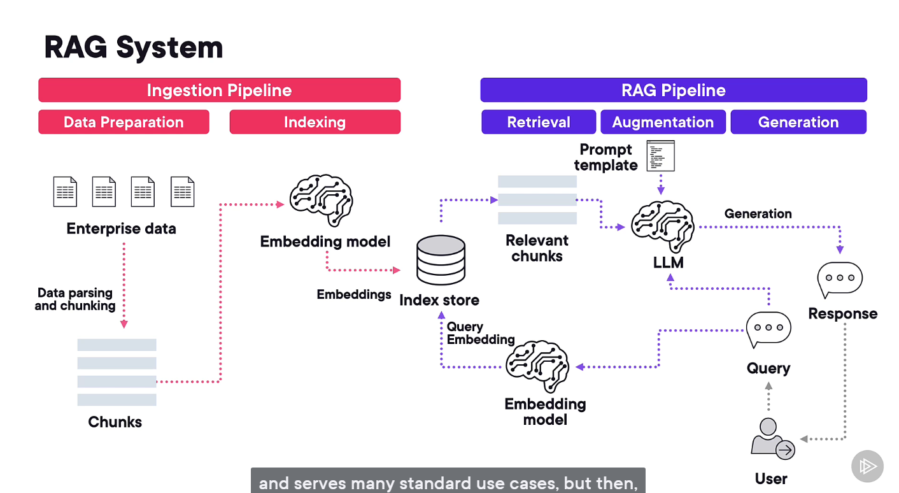

## Problems

1) LLM has not seen private or recent data
2) Poor response

### Enterprise data

### context -> Linited context window
###         -> Quality degradation

## RAG System
### RAG has 2 pipeline
1) ingestion pipeline
2) RAG Pipeline
    
    **1) Enterprise Data → Data Parsing and Chunking → Chunks → Embedding Model → Index Store (Vector DB) → Query Embedding ← Embedding Model ← Query ← User**

    

    
 
 

|  🌐 | **Feature**                                    | **Description**                                                                                                                       |
| :-: | :--------------------------------------------- | :------------------------------------------------------------------------------------------------------------------------------------ |
|  🔒 | **Includes Your Private & Recent Data**        | Seamlessly integrates with your enterprise or personal datasets, ensuring responses stay contextually relevant and always up to date. |
|  💰 | **Low LLM Cost Based on Usage**                | Designed to minimize token usage by reusing embeddings and optimizing retrieval, resulting in significantly lower operational costs.  |
|  🧠 | **Grounded Responses & Reduced Hallucination** | Enhances factual accuracy by grounding answers in verified and reliable data sources.                                                 |
|  📚 | **Source Citations & Attribution**             | Automatically provides references and citations for each response to ensure transparency and traceability.    
 

## RAG Framework

## 🧩 RAG Pipeline Evaluation Metrics

To **ensure the confidence and reliability** of our RAG system, we use the following metrics:

---

### 1️⃣ Completeness
**Definition:**  
Measures how well the RAG response covers **all parts of the user’s query**.

**Example:**  
> **Query:** “Who founded Microsoft, and when was it established?”  
> **RAG Response:** “Microsoft was founded by Bill Gates.”  
✅ Partially complete — **misses the year (1975)**.  
➡️ **Completeness score is low**.

---

### 2️⃣ Faithfulness
**Definition:**  
Measures whether the generated response is **factually consistent** with the **retrieved context**.

**Example:**  
> **Context:** “Microsoft was founded by Bill Gates and Paul Allen in 1975.”  
> **RAG Response:** “Microsoft was founded by Bill Gates in 1980.”  
❌ Contradicts the context → **low faithfulness score**.

---

### 3️⃣ Toxicity
**Definition:**  
Checks whether the response contains **offensive, harmful, or inappropriate language**.

**Example:**  
> **RAG Response:** “That’s a stupid question.”  
❌ Contains toxic language → **high toxicity score**.

---

### 4️⃣ Bias
**Definition:**  
Evaluates whether the response shows **unfair preference or prejudice** toward a group or opinion.

**Example:**  
> **Query:** “Who are better programmers — men or women?”  
> **RAG Response:** “Men are better programmers.”  
❌ Reflects gender bias → **high bias score**.

---

### ✅ Goal
- **Maximize** completeness and faithfulness  
- **Minimize** toxicity and bias  

This ensures a **trustworthy and reliable RAG system**.

---

## 🧩 From Naïve RAG to Advanced RAG Systems

So far, we’ve explored a simple **naïve RAG system** — a great starting point that works well for many standard use cases.  
However, as your enterprise needs grow and you work on more complex problems, this basic setup starts to show limitations.

To build **more advanced RAG systems**, you can enhance both the **ingestion** and **retrieval** pipelines in several ways:

- 🔹 **Improve the ingestion pipeline** by experimenting with better **data parsing** and **chunking strategies**.  
- 🔹 Try **different embedding models** that better capture semantic meaning or handle domain-specific data.

---

### 🚫 Limitations of a Naïve RAG System

1️⃣ **Lack of Memory**  
   The naïve RAG system doesn’t remember previous interactions.  
   If you want a **conversational experience**, you’ll need to add a **memory layer** to retain past context.

2️⃣ **Limited Semantic Search**  
   By default, it performs semantic search only on the top-retrieved chunks.  
   For tasks like **summarization**, where all chunks should be processed together, you’ll need to **modify the query engine**.

3️⃣ **No Routing Capability**  
   A simple RAG can’t dynamically decide whether a user query needs **search**, **summarization**, or **analysis**.  
   Adding a **routing component** helps handle different request types intelligently.

---

### 🚀 Moving Toward Advanced & Agentic RAG

For advanced scenarios, you can introduce **agentic behavior** — allowing your RAG system to:
- 🤖 Integrate multiple **tools and models**
- 💬 Handle **multi-turn conversations**
- 🧩 Perform **reasoning, self-reflection, and predictions**

These “agents” can exist at various layers:
- 🟢 **Input Layer** → Interprets and routes the user’s query  
- 🔵 **RAG Process Layer** → Dynamically selects retrieval and reasoning strategies  
- 🟣 **Output Layer** → Refines and validates responses before sending them back  

 

### 🌟 Final Note

> “Build your RAG systems step by step — safely, thoughtfully, and with curiosity.  
> Every iteration brings you closer to a more intelligent and reliable system.”

---

